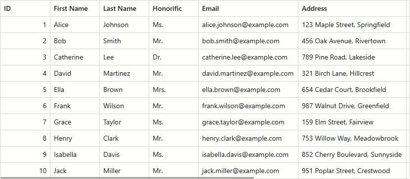

<!-- default badges list -->
[](https://docs.devexpress.com/GeneralInformation/403183)
[](#does-this-example-address-your-development-requirementsobjectives)
<!-- default badges end -->
# Blazor Grid – How to Fit Columns to Content and Available Space

This example implements a [DevExpress Blazor Grid](https://docs.devexpress.devx/Blazor/403143/components/grid) column layout that adapts to different desktop screen sizes as follows:

* Columns occupy available space
* Cell content is always visible (word trimming/wrapping is disabled)



## Implementation Details

1. Bind our Blazor Grid to a data source and populate the component with columns.

2. Use the [Grid.TextWrapEnabled](https://docs.devexpress.devx/Blazor/DevExpress.Blazor.DxGrid.TextWrapEnabled) property to disable word wrapping.

3. Identify columns with fixed content width (for instance, ID, Date, Name). For "fixed content width" columns, assign maximum content length to [MinWidth](https://docs.devexpress.devx/Blazor/DevExpress.Blazor.DxGridColumn.MinWidth) ([Width](https://docs.devexpress.devx/Blazor/DevExpress.Blazor.DxGridColumn.Width) property must not be set). This configuration ensures that a column does not shrink below a specified limit but can stretch on wide screens.

4. For remaining columns, set [Width](https://docs.devexpress.devx/Blazor/DevExpress.Blazor.DxGridColumn.Width) to `0px`.

5. Call the [AutoFitColumnWidths](https://docs.devexpress.devx/Blazor/DevExpress.Blazor.DxGrid.AutoFitColumnWidths) method to adjust zero-width columns to content and stretch fixed-width columns.

```csharp
IGrid Grid { get; set; }
List<string> FixedWidthColumnCaptions = new List<string> { "ID", "First Name", 
                                        "Last Name", "Honorific", "Occupation" };

protected override void OnAfterRender(bool firstRender) {
    if (firstRender) {
        Grid.BeginUpdate();
        foreach (var column in Grid.GetColumns()) {
            if (FixedWidthColumnCaptions.Contains(column.Caption)) {
                column.MinWidth = 100;
            } 
            else {
                column.Width = "0px";
            }
        }
        Grid.EndUpdate();
        Grid.AutoFitColumnWidths();
    }
}
```

## Files to Review

- [Index.razor](https://github.com/DevExpress-Examples/draft-DxGrid-AutoFit-Example/blob/25.1.7%2B/CS/DxGrid.AutoFit/Components/Pages/Index.razor)
- [Person.cs](https://github.com/DevExpress-Examples/draft-DxGrid-AutoFit-Example/blob/25.1.7%2B/CS/DxGrid.AutoFit/Models/Person.cs)
- [PersonDataService.cs](https://github.com/DevExpress-Examples/draft-DxGrid-AutoFit-Example/blob/25.1.7%2B/CS/DxGrid.AutoFit/Services/PersonDataService.cs)

## Documentation

- [Blazor Grid – Columns](https://docs.devexpress.devx/Blazor/404479/components/grid/columns/columns)

## More Examples

- [Blazor Grid – Responsive Layout Demo](https://demos.devexpress.com/blazor/LayoutBreakpoint#ResponsiveLayout)

<!-- feedback -->
## Does this example address your development requirements/objectives?

[](https://www.devexpress.com/support/examples/survey.xml?utm_source=github&utm_campaign=draft-DxGrid-AutoFit-Example&~~~was_helpful=yes) [](https://www.devexpress.com/support/examples/survey.xml?utm_source=github&utm_campaign=draft-DxGrid-AutoFit-Example&~~~was_helpful=no)

(you will be redirected to DevExpress.com to submit your response)
<!-- feedback end -->
